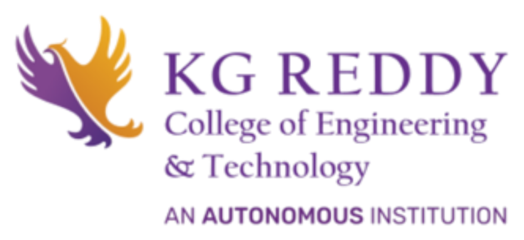
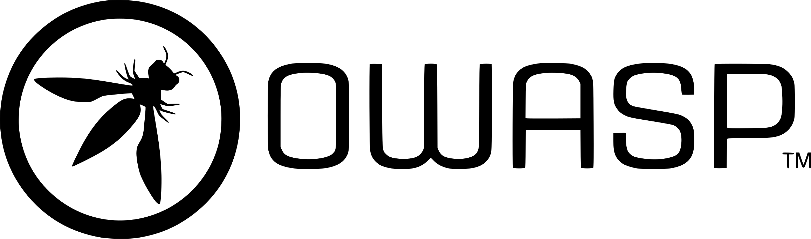
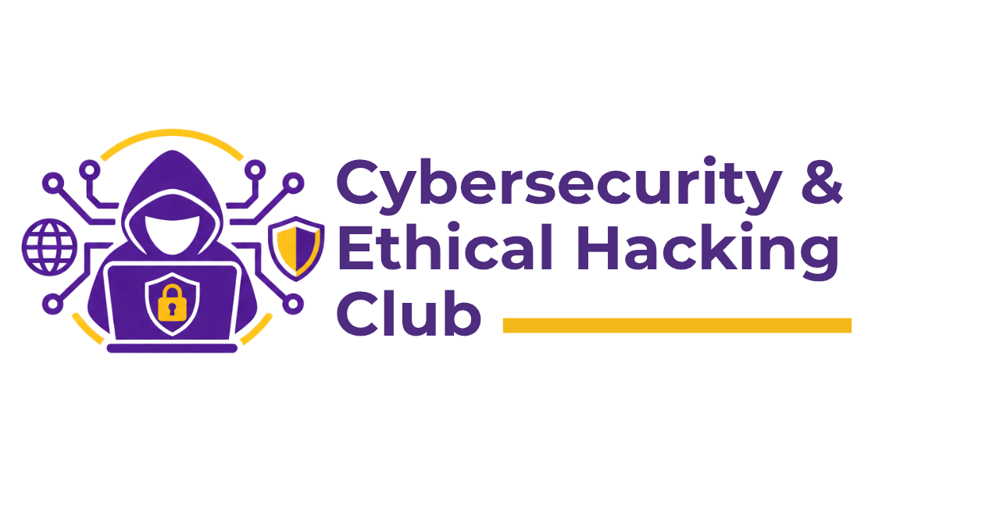

&nbsp;&nbsp;&nbsp;&nbsp;&nbsp;&nbsp;

&nbsp;&nbsp;&nbsp;&nbsp;&nbsp;&nbsp;

 

## Welcome

Welcome to the OWASP KG Reddy College of Engineering and Technology Student Chapter. The OWASP KGRCET Student Chapter connects students of KG Reddy College of Engineering and Technology with the global OWASP community and provides opportunities to learn, collaborate, and contribute to the field of application security.

Our chapter focuses on practical cybersecurity education, application security, ethical hacking, Capture the Flag (CTF) challenges, security projects, research, and interaction with cybersecurity professionals.

## Our Mission

Our mission is to create a collaborative environment where students can develop practical security skills, explore application security, and engage with the broader cybersecurity community. We aim to:

- Promote practical cybersecurity and application security education
- Organize hands-on technical workshops and sessions
- Conduct Capture the Flag (CTF) challenges and security competitions
- Encourage student-led cybersecurity projects and research
- Connect students with cybersecurity professionals and the OWASP community
- Provide opportunities for collaboration, learning, and knowledge sharing

## Activities

The chapter will organize and support activities including:

### Hands-on Workshops
Practical sessions covering cybersecurity and application security concepts, tools, techniques, and real-world security scenarios.

### Capture the Flag
CTF challenges designed to help students develop practical skills through problem-solving and security-focused challenges.

### Security Projects and Research
Student-led projects and research initiatives focused on understanding security problems and developing practical solutions.

### Community and Industry Sessions
Technical sessions, discussions, and interactions with cybersecurity professionals, researchers, and members of the OWASP community.

## Get Involved

Students interested in application security and cybersecurity are welcome to participate in chapter activities. You can attend our events, take part in challenges, contribute to projects, and connect with the wider OWASP community.

Contact us: jashanthgonipati@gmail.com

## Participation

The Open Worldwide Application Security Project (OWASP) is a nonprofit foundation that works to improve the security of software. All of our projects, tools, documents, forums, and chapters are free and open to anyone interested in improving application security.

Chapters are led by local leaders in accordance with the [Chapters Policy](/www-policy/operational/chapters). Financial contributions should only be made online using the authorized online donation button.

Everyone is welcome and encouraged to participate in our [Projects](/projects/), [Local Chapters](/chapters/), [Events](/events/), [Online Groups](https://groups.google.com/a/owasp.com/){:target='_blank'}, and [Community Slack Channel](https://owasp.slack.com/){:target='_blank'}. We especially encourage diversity in all our initiatives. OWASP is a fantastic place to learn about application security, to network, and even to build your reputation as an expert. We also encourage you to [become a member](/membership/) or consider a [donation](/donate/) to support our ongoing work.

## About OWASP

The Open Worldwide Application Security Project (OWASP) is a nonprofit foundation working to improve the security of software. OWASP provides open projects, tools, documentation, educational resources, and community initiatives for people interested in application security.

Learn more at [owasp.org](https://owasp.org)

## Next Meeting/Event

